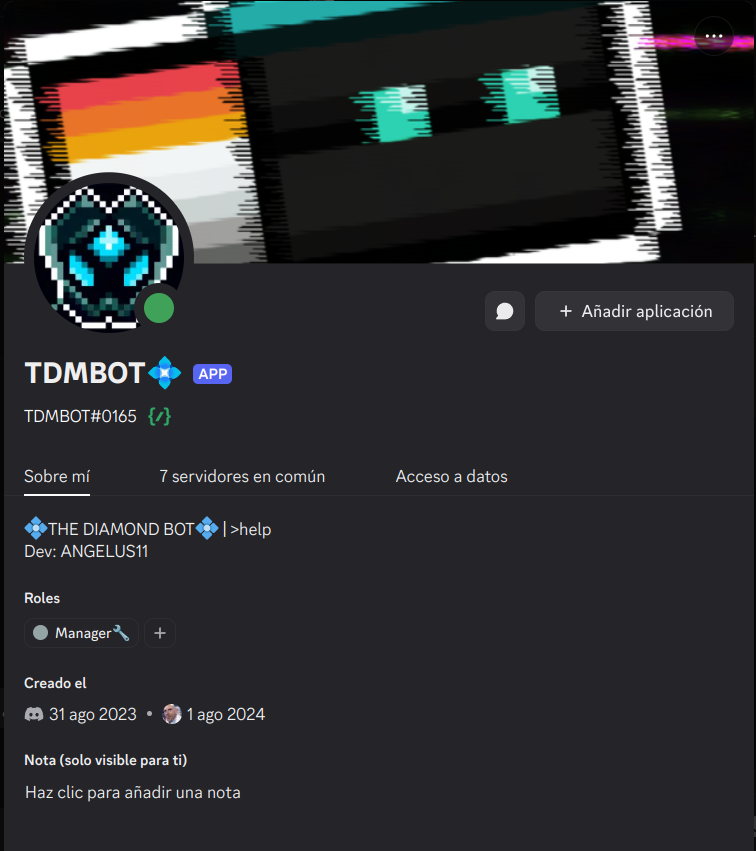

## **💠TDMBOT Discord Bot**  
Made with Python and Discord.py  


---

## ES🇪🇸  
## Documentación📚  
Using la página de [DeepWiki](https://deepwiki.com/), el modelo DevinAI me ha generado una documentación completa y descriptiva de todo el proyecto, la cual podrán consultar mediante el siguiente enlace:  
[TDMBOT Docs](https://deepwiki.com/ANGELUSD11/TDMBOT)  
### ¿Qué es TDMBOT💠?  
TDMBOT💠 es un bot de discord creado desde 0 con Python y con ayuda de la librería [Discord.py](https://discordpy.readthedocs.io/en/stable/), la opción por excelencia para desarrollar bots de discord con este maravilloso lenguaje🐍, esta potente librería Open Source ofrece una integración completa y funcional con la API de Discord permitiéndonos crear nuestros bots de manera sencilla, su sintaxis y sus clases nos servirán para interactuar con todo lo que tiene Discord para ofrecernos al crear nuestras aplicaciones, en mi caso he integrado todo esto con aún más librerías conocidas, usadas mucho en el ecosistema de Python con la finalidad de dotar al bot de funcionalidades interesantes, como mensajes generados por IA gracias a la API del modelo Gémini de Google🧠, a continuación explicaré todos los comandos que hasta ahora el bot tiene para ofrecer.  

---

## Comandos disponibles📝    

```
>help: Para visualizar todos los comandos e información general del bot
>ia(prompt): Consultar cualquier duda o interactuar con el modelo Gémini 1.5 flash de Google, puedes adjuntar imágenes
>wiki(query): Búsqueda de algún artículo en Wikipedia
>img(query): Búsqueda de imágenes en Google
>yt(query): Búsqueda de videos en YouTube
>google(query): Búsqueda simple en Google
>meme/dankmeme/shitpost: Selecciona algún meme aleatorio de Reddit y lo envía al chat
>cat: Selecciona alguna imagen alearoria de gatitos y la envía al chat
>avatar(username): Muesra el avatar de un usuario
>spotify(username): Muestra lo que está escuchando un usuario en Spotify (el comando más inútil del bot)
>binary(int value): Convierte un número entero a binario
>convert(to_bin, to_text: text, bin): Convierte texto a binario y viceversa
>ocr(language code): Extrae texto de imágenes en distintos idiomas, especificados con su código de idioma
>translate(language: text): Traduce texto en distintos idiomas especificado el código de idioma a traducir
>dl(url): Descarga video de distintos sitios web y lo muestra en chat
>join/leave/stop: Comandos para usar en los canales de voz
```


---


## Limitaciones a considerar💡  
1: El comando ```>dl``` no puede descargar contenido de YouTube ya que el sitio detecta las solicitudes del bot como tráfico automatizado, estoy trabajando en arreglar esto.   
2: Tienes que agregar todos los parámetros necesarios en ciertos comandos  
- En ```>translate``` tienes que agregar los códigos de idioma siguiendo el estandar [ISO 639-1](https://es.wikipedia.org/wiki/ISO_639-1)
- En ```>ocr``` tienes que agregar los códigos de idioma que se usan en los traineddata de [Tesseract](https://github.com/tesseract-ocr/tessdata)

## Tecnologías y librerías utilizadas⌨️  
- asyncio(módulo por defecto de Python para manejar concurrencia y asincronismo)
- [Discord.py](https://pypi.org/project/discord.py/) (API de Discord)
- [python-dotenv](https://pypi.org/project/python-dotenv/)(librería para cargar variables de entorno)
- [PyNaCl](https://pypi.org/project/PyNaCl/)(implementación de la librería NaCl para encriptación de datos)
- [Wikipedia](https://pypi.org/project/wikipedia/)(API de Wikipedia)
- [praw](https://pypi.org/project/praw/)(API de Reddit)
- [pillow](https://pypi.org/project/pillow/)(librería para el procesamiento de imágenes)
- [requests](https://pypi.org/project/requests/)(librería para el manejo de solicitudes HTTP)
- [google-api-python-client](https://pypi.org/project/google-api-python-client/)(API de Google)
- [tesserocr](https://pypi.org/project/tesserocr/)(implementación del motor Tesseract-OCR para el procesamiento óptico de carácteres)
- [yt-dlp](https://pypi.org/project/yt-dlp/)(implementación de la herramienta de CLI yt-dlp, usada para la descarga de videos)
- [deep-translator](https://pypi.org/project/deep-translator/)(API del traductor de deep)
- [gTTS](https://pypi.org/project/gTTS/)(Motor de tts de Google para conversión de texto a voz)
- [google-generativeai](https://pypi.org/project/google-generativeai/)(SDK oficial de Google para interactuar con sus LLMs por medio de su API)

## Primeros pasos↗️  
Puedes invitar el bot a tu servidor mediante el [enlace de invitación](https://discord.com/oauth2/authorize?client_id=1367861699683549276) de manera sencilla, sin embargo, si quieres levantar el proyecto localmente usando todos tus tokens, puedes hacerlo de la siguiente manera:  
1. Asegúrate de tener Python correctamente instalado y configurado en tu IDE favorito😃  
2. Clona el repositorio o descarga el fichero
```bash
git clone https://github.com/ANGELUSD11/TDMBOT.git
```  
3. Instala todos los paquetes necesarios con pip mediante el .txt que he dejado
```bash
pip install requirements.txt
```  
4. Reemplaza todos tus tokens y api keys en el archivo ```.env``` para que el bot pueda consumir sus APIs(cuidado👀, recuerda que estos datos son sensibles y no se pueden exponer)  
5. Ejecuta el script ```bot.py``` que se encuentra en ```/src/bot.py```  
Este script contiene un bucle for que recorre todos los módulos del bot divididos en cogs y luego informa en terminal si se ejecutaron correctamente.

## Configuración inicial Discord.py  
Esta sección proporciona instrucciones paso a paso para instalar y configurar un bot de discord usando esta tecnología, desde la instalación inicial hasta la primera ejecución.Configuración necesaria para un bot multifuncional para Discord desarrollado con Python y discord.py.

Antes que nada, asegúrate de tener instalada la librería de Discord.py para acceder a todas las funcionalidades de su API: [repositorio de PyPI](https://pypi.org/project/discord.py/)
```bash
pip install discord.py
```
Luego, dentro de tu proyecto, crea un script inicial e importa la librería junto con los módulos que necesites

Módulo general:
```python
import discord
```

Módulo para utilidades de comandos:
```python
import discord.ext
from discord.ext import commands
```

Recomiendo importar el módulo os que provee Python para trabajar con rutas de archivos:
```python
import os
```

Recomiendo importar el módulo json para trabajar con estos formatos si vas a consumir apis:
```python
import json
```

---

## EN🇺🇸  
## Documentation📚  
Using the [DeepWiki](https://deepwiki.com/) webpage, the Devin AI model generated detailed documentation of the technical process throughout the development flow, you will find it at the following link:  
[TDMBOT Docs](https://deepwiki.com/ANGELUSD11/TDMBOT)  
### What is TDMBOT💠?
TDMBOT💠 is a Discord bot built from scratch using Python and the [Discord.py](https://discordpy.readthedocs.io/en/stable/) library far the top choice for developing Discord bots with this amazing language🐍. This powerful open-source library offers full and functional integration with the Discord API, allowing us to create bots easily. Its syntax and classes allow interaction with everything Discord has to offer when building applications.
In my case, I have integrated this with even more well-known libraries widely used in the Python ecosystem to give the bot interesting capabilities, such as AI-generated messages via Google's Gemini API🧠. Below, I’ll explain all the commands the bot currently offers.

---

## Available commands📝

```
>help: View all commands and general information about the bot
>ia(prompt): Ask any question or interact with Google’s Gemini 1.5 flash model you can attach images
>wiki(query): Search for a Wikipedia article
>img(query): Search for images on Google
>yt(query): Search for YouTube videos
>google(query): Simple Google search
>meme/dankmeme/shitpost: Picks a random meme from Reddit and sends it to the chat
>cat: Picks a random cat image and sends it to the chat
>avatar(username): Displays a user's avatar
>spotify(username): Shows what a user is listening to on Spotify (the most useless command on the bot)
>binary(int value): Converts an integer to binary
>convert(to_bin, to_text: text, bin): Converts text to binary and vice versa
>ocr(language code): Extracts text from images in different languages, specified by their language code
>translate(language: text): Translates text into different languages using the target language code
>dl(url): Downloads a video from various websites and sends it in the chat
>join/leave/stop: Commands to use in Bot channels
```


---


## Limitations to consider💡
1: The command ```>dl``` cannot download content from YouTube since the site detects the bot’s requests as automated traffic. I'm working on fixing this.  
2: You must provide all required parameters for certain commands:
- For ```>translate```, you must use language codes following the [ISO 639-1](https://en.wikipedia.org/wiki/ISO_639-1) standard
- For ```>ocr```, you must use the language codes used in [Tesseract's traineddata](https://github.com/tesseract-ocr/tessdata) files

## Technologies and Libraries Used⌨️  
- asyncio (Python’s default module for handling concurrency and asynchronous programming)
- [Discord.py](https://pypi.org/project/discord.py/) (Discord API wrapper)
- [python-dotenv](https://pypi.org/project/python-dotenv/) (library for loading environment variables)
- [PyNaCl](https://pypi.org/project/python-dotenv/) (Python wrapper for the NaCl library for data encryption)
- [Wikipedia](https://pypi.org/project/wikipedia/) (Wikipedia API wrapper)  
- [praw](https://pypi.org/project/praw/) (Reddit API wrapper)
- [pillow](https://pypi.org/project/pillow/) (library for image processing)
- [requests](https://pypi.org/project/requests/) (library for handling HTTP requests)  
- [google-api-python-client](https://pypi.org/project/google-api-python-client/) (Google API client library)  
- [tesserocr](https://pypi.org/project/tesserocr/) (Tesseract-OCR engine implementation for optical character recognition)  
- [yt-dlp](https://pypi.org/project/yt-dlp/) (CLI tool implementation for downloading videos)  
- [deep-translator](https://pypi.org/project/deep-translator/) (API wrapper for DeepL and other translation services)
- [gTTS](https://pypi.org/project/gTTS/)(Google TTS engine for text-to-speech conversion)
- [google-generativeai](https://pypi.org/project/google-generativeai/) (Official Google SDK for interacting with their LLMs via API)

## Getting Started ↗️  
You can easily invite the bot to your server using the [invitation link](https://discord.com/oauth2/authorize?client_id=1367861699683549276).  
However, if you want to run the project locally using your own tokens, you can do so as follows:  

1. Make sure you have Python properly installed and configured in your favorite IDE 😃  
2. Clone the repository or download the file  
```bash
git clone https://github.com/ANGELUSD11/TDMBOT.git
```
3. Install all required packages with pip using the provided .txt file
```bash
pip install requirements.txt
```  
4. Replace all your tokens and API keys in the ```.env``` file so the bot can access its APIs
(Careful 👀, remember these are sensitive values and should not be exposed)
5. Run the ```bot.py``` script located in ```/src/bot.py```
This script contains a for loop that loads all the bot’s modules (organized in cogs) and then logs in the terminal if they were loaded successfully.
